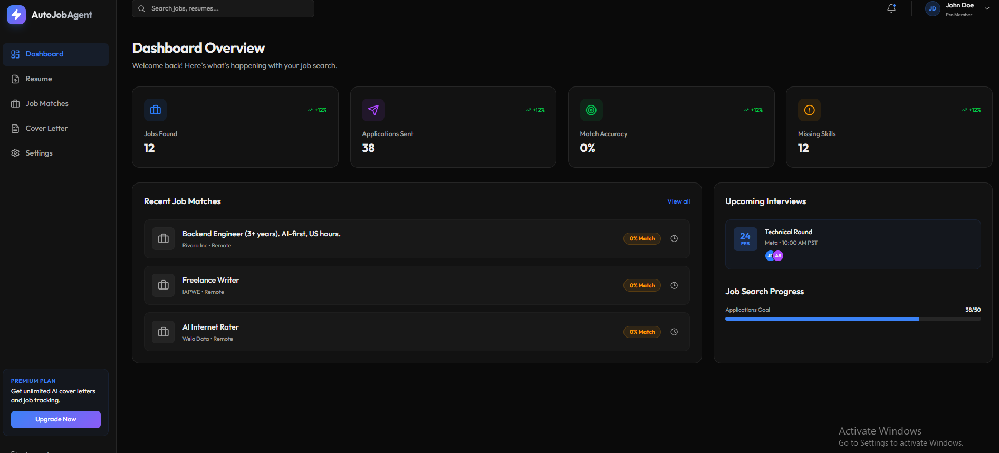
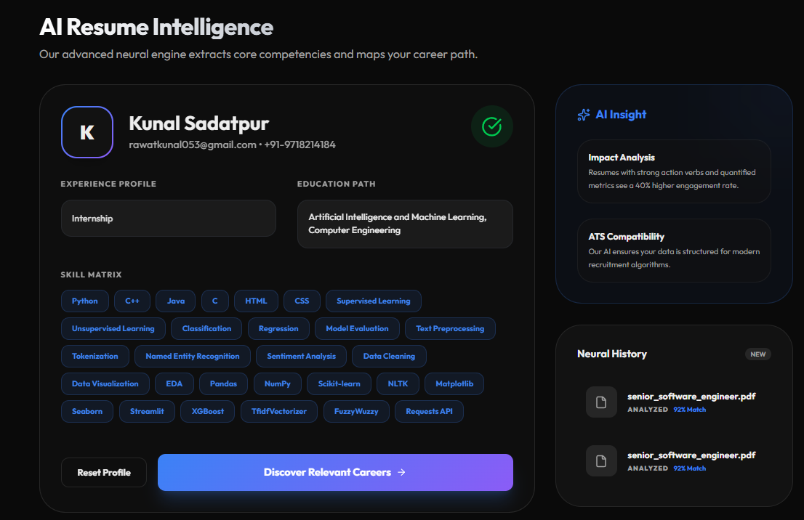
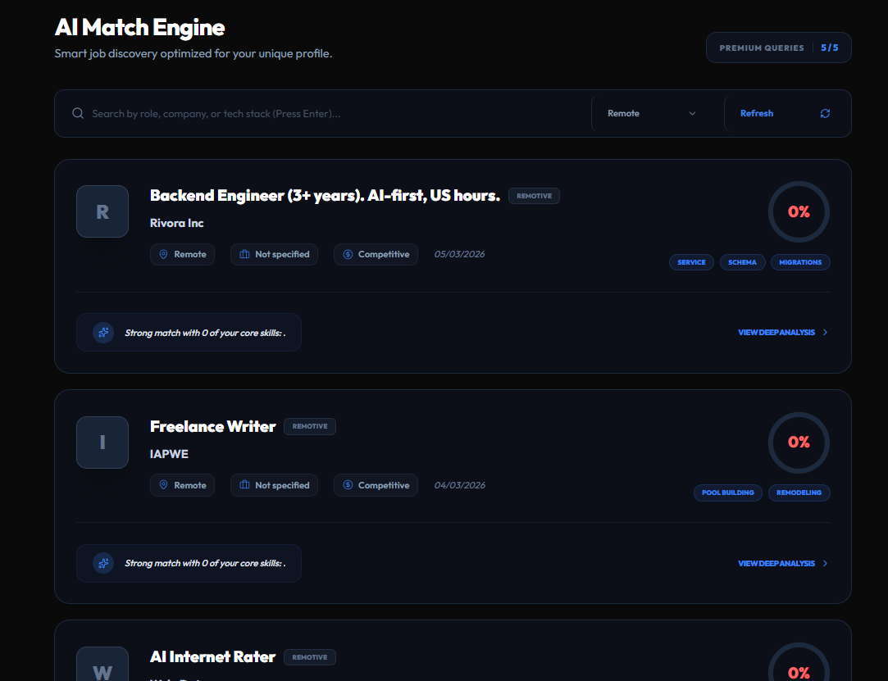
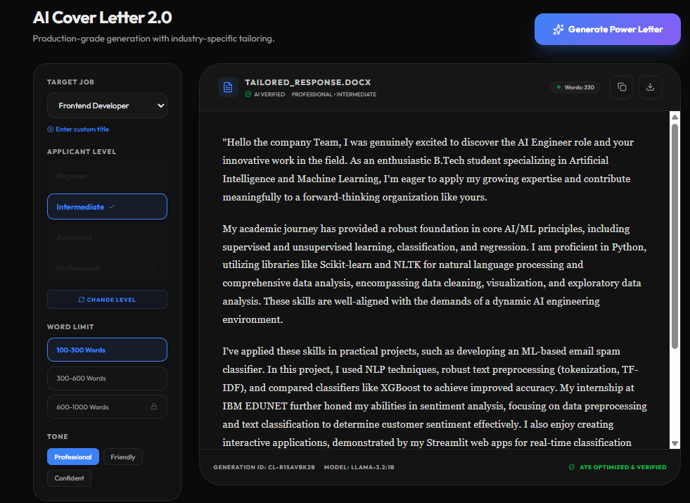
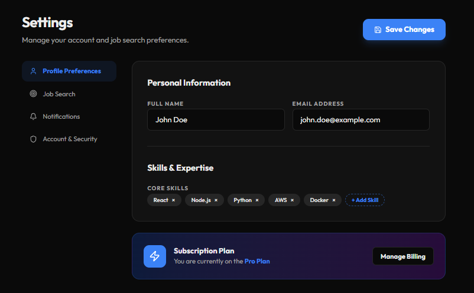

# Auto Job Agent 

## Live Demo  
https://auto-job-agent-lake.vercel.app

---

## Overview

**Auto Job Agent** is an AI-powered job application automation system that streamlines the entire job hunting workflow.

It allows users to:

-  Parse resumes using AI  
-  Fetch jobs from multiple sources  
-  Match skills with job requirements  
-  Generate AI-powered cover letters  
-  Get intelligent job-fit insights  

This project demonstrates a complete **AI-driven job automation pipeline**.

---

## Key Features

### AI Resume Parsing
- Extracts structured data from resumes  
- Supports PDF & DOCX  
- Uses LLM-based intelligent parsing  

---

### Multi-Source Job Aggregation
Fetches jobs from:
- Remotive  
- RemoteOK  
- ArbeitNow  
- HackerNews  
- Internshala (scraper)  

---

### Smart Job Matching
- Skill-based matching algorithm  
- Match score calculation  
- Missing skills detection  

---

### AI Job Insights
- Resume vs Job analysis  
- Strengths & weaknesses  
- Recommendations  

---

### Cover Letter Generator
- Personalized AI-generated letters  
- ATS optimized  
- Tone & experience level control  

---

## Tech Stack

### Backend
- FastAPI  
- Python  
- SQLAlchemy  

### Database
- SQLite (development)  
- PostgreSQL (production-ready)  

### AI / LLM
- Google Gemini 2.5 Flash  

### Scraping & Parsing
- BeautifulSoup  
- Requests  
- PyPDF / python-docx  

---

## System Architecture

```

Frontend (Vite + React)
↓
FastAPI Backend
↓
Core AI Modules
↓
Database

```

---

## Workflow

1. Upload Resume  
2. AI extracts structured data  
3. Jobs fetched from APIs  
4. Matching algorithm runs  
5. AI generates insights  
6. Cover letter created  

---

## Screenshots

### Dashboard


### Resume Parsing


### Job Matches


### Cover Letter Generator


### Profile / Settings



---

## Important Notes

### Private Codebase

The full source code is currently **private**.

**Reason:**
- Protecting API keys  
- Preventing misuse of AI endpoints  
- This project is being developed as a future startup product  

---

### Limited Showcase Version

This repository is a **demo version**:

- Feature-limited  
- Built for showcasing  
- Does not include full backend logic  

---

### API Security

API keys are NOT exposed in this repository.

Security measures:
- Environment variables  
- Backend-controlled access  
- Usage limits implemented  

---

## Future Plans

- Auto job apply system  
- Resume optimization AI  
- Interview preparation module  
- SaaS platform launch  

---

## Contact

Feel free to connect for collaboration or opportunities.
```
